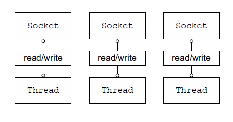

# 第一章 Netty—异步和事件驱动

 Netty 是一款异步的事件驱动的网路应用程序框架，支持快速地开发可维护地高性能的面向协议的服务器和客户端。

- 关注点分离——业务和网络逻辑解耦。
- 模块化和可复用性。
- 可测试性作为首要的要求。

## 1.1 Java 网络编程

早期 `JavaAPI (java.net) `只支持由本地系统套接字库提供的所谓的阻塞函数。

~~~java
// 创建一个新的 ServerSocket, 用以监听指定端口的连接请求
ServerSocket serverSocket = new ServerSocket(portNumber);
//对 accept() 方法的调用将被阻塞，直到一个连接建立
Socket clientSocket = serverSocket.accept();
// 这些流对象都派生与该套接字的流对象
BufferedReader in =
    new BufferedReader(new InputStreamReader(clientSocket.getInputStream()));
PrintWriter out = new PrintWriter(clientSocket.getOutputStream(), true);
String request, response;
// readLine() 方法将会被一直阻塞，直到一个由换行符或者回车结尾的字符串被读取。
while ((request = in.readLine()) != null) {
    // 如果客户端发送 “Done”，则退出处理循环
    if ("Done".equals(request)) {
        break;
    }
    // 请求被传递给服务器的处理方法
    response = processRequest(request);
    // 服务器的响应被发送给客户端
    out.println(response);
//继续执行处理循环
}
~~~

这端代码只能同时处理一个连接，要管理多个并发客户端，需要为每个新的客户端 Socket 创建一个新的 Thread，如图所示：

这种方案的影响：第一，在任何时候都可能有大量的线程处于休眠状态，只是等待输入或者输出数据就绪，这可能是一种资源浪费。第二，需要为每个线程的调用栈都分配内存。第三，即使 Java 虚拟机（JVM）在物理上可以支持非常大数量的线程，但是远在到达极限之前，上下文切换带来的开销就会非常麻烦。

### 1.1.1 Java NIO

除阻塞系统调用以外，本地套接字库也提供了非阻塞调用：

- 可以使用 `setSocket()` 方法设置套接字，以便读/写调用在没有数据的时候立刻返回。
- 可以使用操作系统的事件通知 API 注册一组非阻塞套接字，以确定它们中是否有任何的套接字已经有数据可供读写。

### 1.2.1 选择器

下图为一个非阻塞设计，消除了上节中提到的弊端。

`Class java.nio.channels.Selector` 是 Java 非阻塞 I/O 实现的关键。它使用了事件通知 API 以确定在一组非阻塞套接字中有哪些已经准备就绪能够进行 I/O 相关操作。因为可以在任何时间检查任意的读写操作的完成状态。一个线程可以处理多个并发连接。

于阻塞 I/O 模型相比，这种模型提供了更好的资源管理：

- 使用较少的线程可以处理更多的连接，因此也减少了内存管理和上下文切换所带来的开销。
- 当没有 I/O 操作需要处理的时候，线程可以被用于其他任务。

## 1.2 Netty 简介

Netty 的特性总结。

| 分类     | Netty的特性                                                  |
| -------- | ------------------------------------------------------------ |
| 设计     | 统一的 API，支持多种传输类型，阻塞的和非阻塞的 简单而强大的线程模型 真正的无连接数据报套接字支持 链接逻辑组件以支持复用 |
| 易于使用 | 详实的Javadoc和大量的示例集 不需要超过JDK 1.6+③的依赖。（一些可选的特性可能需要Java 1.7+和/或额外的依赖） |
| 性能     | 拥有比 Java 的核心 API 更高的吞吐量以及更低的延迟 得益于池化和复用， 拥有更低的资源消耗 最少的内存复制 |
| 健壮性   | 不会因为慢速、快速或者超载的连接而导致 OutOfMemoryError 消除在高速网络中 NIO 应用程序常见的不公平读/写比率 |
| 安全性   | 完整的 SSL/TLS 以及 StartTLS 支持 可用于受限环境下，如 Applet 和 OSGI |
| 社区驱动 | 发布快速而且频繁                                             |

### 1.2.1 谁在使用 Netty

### 1.2.2 异步和事件驱动

异步事件可以具有某种有序关系。

异步的能力对于实现最高级别的可伸缩性至关重要，定义为：“ 一种系统、 网络或者进程在需要处理的工作不断增长时， 可以通过某种可行的方式或者扩大它的处理能力来适应这种增长的能力。” 
 异步和可伸缩性之间的联系： 

- 非阻塞网络调用使得我们可以不必等待一个操作的完成。完全异步的 I/O 正是基于这个特性构建的，并且更进一步：异步方法会立即返回，并且在它完成时，会直接或者在稍后的某个时间点通知用户。 
- 选择器使得我们能够通过较少的线程便可监视许多连接上的事件。

 ## 1.3 Netty 的核心组件

Netty 的主要构件块：

- Channel
- 回调
- Future
- 事件和 ChannelHandler

### 1.3.1 Channel

Channel 是 JavaNIO 的一个基本构造。

> 它代表一个到实体（如一个硬件设备、一个文件、一个网络套接字或者一个能够执行一个或者多个不同的 I/O 操作的程序组件）的开放连接，如读操作和写操作。

