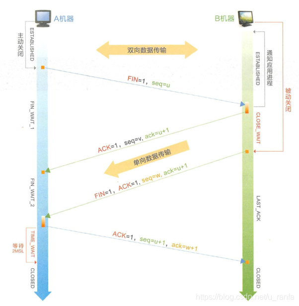

# 第 1 章 计算机基础

## 1.1 走进 0 与 1 的世界

原码:就是早期用来表示数字的一种方式: 一个正数，转换为二进制位就是这个正数的原码。负数的绝对值转换成二进制位然后在高位补1就是这个负数的原码

反码:正数的反码就是原码，负数的反码等于原码除符号位以外所有的位取反。

补码:正数的补码与原码相同，负数的补码为 其原码除符号位外所有位取反（反码），然后最低位加1。

位移运行

`<<` 左移和 `>>` 运算中符号位均参与移动，除负数右移时，高位补 1 以外，其他情况均在空位补 0。

`>>>` 无符号右移：当向右移时，正负数高位均补 0。

其他位运算：按位取反（~）、按位与（&）、按位或（|）、按位异或（^）。

注意按位与和逻辑与（&&）运算都可以用于条件运算，但后者有短路功能。同样，按位或对应的逻辑或运算（||）也有短路功能。

## 1.2 浮点数

计算机定义了两种小数，分别为定点小数和浮点数。

浮点数是以科学计数法表示。

### 1.2.1 科学计数法

浮点数由符号位、有效数字、指数三部分组成。

### 1.2.2 浮点数表示

当从数学世界的科学记数法映射到计算机内的浮点数，数制从十进制转变为二进制时，相关称谓有所改变：指数称为阶码，有效数字称为位数。

IEEE754标准规定了 4 种浮点数：单精度、双精度、延申单精度，延申双精度。

浮点数无法表示零值，取值区间分为两个区间：正数区间和负数区间。

以32位单精度浮点数为例，最高位为符号位，符号位右侧8位为阶码位。后23位为尾数位。

1. 符号位： 在最高二进制位上分配1位表示浮点数的符号，0表示正数，1表示负数。

2. 阶码位： 在符号位右侧分配8位用来存储指数，作为阶码位。而阶码位存储的是指数对应的移码，而不是指数对应的原码或者补码。

   移码：（又叫增码）是符号位取反的补码

   移码的计算规则：[X移]=x+ 2^(n-1) n为x的二进制位数，含符号位
   移码的几何意义是把真值映射到一个正数域，可以直观的反应两个真值的大小。
   而在计算机中，假设指数的真值为e，阶码为E，则有E = e + 2^(n-1) - 1;
   偏移值为 2^(n-1) - 1;而不是2^(n-1)的原因：
   8个二进制位的取值范围为[-128-127]，现在将指数变成移码的形式，即将区间[-128-127]正向平移到正数域，区间内每个数加上128，变为[0, 255],计算机中规定阶码全为0或者全为1的两种情况当作特殊值处理(0，无穷大)去掉这两个值，则范围变为[1,254]，按照换算关系，这样得到的指数范围为[-127, 126]，指数最大只能取到126，这样就缩小了浮点数的取值范围，所以将阶码的偏移量设为2^(n-1) - 1;这样表示的范围为[-126, 127]

3. 尾数位

   最右侧分配连续 23 位用来存储有效数字，IEEE754 标准规定尾数位以原码表示。科学计数法进行规格化的目的是保证浮点数表示的唯一性。二进制数字规格化后的尾数形式为 `1.xyz`，满足 1<= |a|< 2。为了节省空间，将符合规格化尾数的首个 1 省略，所以尾数表面是 23 位，实际表示了 24 位二进制数。

常用浮点数规格化表示结果：

### 1.2.3 加减运算

浮点数之间的加减法运算：
（1）零值检测：如果存在一个数为0（阶码与尾数全为0），直接得出结果。

（2）对阶操作：通过比较阶码的大小来判断小数点的位置是否对齐，阶码不相等，表示并未对齐，若未对齐，则需要通过移动尾数改变阶码的大小。尾数向右移则阶码加 1，尾数向左移动 1 位，阶码减 1。因为向左移动会使误差变大，所以一般为选择较小的阶码对其尾数进行右移操作。（在进行负数移动时，首先求取后23号的补码，之后进行相应的移动，最后在最高位添加1，也就是默认的最高阶位1）；

（3）尾数求和：在对阶操作结束之后，直接按位相加即可（如果是负数，需要转换为补码再进行计算）。

（4）结果规格化：如果运算结果不满足规格化要求，则需要通过尾数的左移或右移达到规格化形式，左移称为左归，右移称为右归。

（5）结果舍入：在对阶过程或右规时，尾数需要右移，最右端被移出的位会被丢弃，从而导致结果精度的损失。为了减少这种精度的损失，先将移出的这部分数据保存起来，称为保护位，等到规格化后再根据保护位进行舍入处理。

### 1.2.4 浮点数使用

在要求绝对精确表示的业务场景下，比如金融行业的货币表示，推荐使用整型存储其最小单位的值，展示时可以转换成该货币的常用单位，比如人民币使用分存储，美元使用美分存储。在要求精确表示小数点n 位的业务场景下，比如圆周率要求存储小数点后1000 位数字，使用单精度和双精度浮点数类型保存是难以做到的，这时推荐采用数组保存小数部分的数据。在比较浮点数时，由于存在误差，往往会出现意料之外的结果，所以禁止通过判断两个浮点数是否相等来控制某些业务流程。在数据库中保存小数时，推荐使用decimal 类型，禁止使用float 类型和double 类型。因为这两种类型在存储的时候，存在精度损失的问题。

## 1.3 字符集与乱码

在ASCII 码中，有两个特殊的控制字符10 和13 ，前者是 LF  即 “\n”，后者是 CR 即 “\r”，在编码过程中，代码的换行虽然是默认不可见的，但在不同的操作系统中，表示方式是不样的。在 UNIX 系统中，换行使用换行符 "\\n"，在window系统中，换行使用 "\\r\\n"；在旧版 macOS 中，换行符使用回车符 "\\r"，在新版macOS 中使用与 UNIX 系统相同的换行方式。前编码环境使用换行方式是LF，这也是推荐的换行方式，避免出现源码在不同操作系统中换行显示不同的情况。

数据库是存储字符之源，在不同层次上都能设置独立的字符集。最好所有情况下字符集设置都是一致的。

## 1.4 CPU 与内存

CPU 是计算机的核心部件。其内部结构如图所示：

内存物理结构由内存芯片、电路板、控制芯片、相关支持模块等组成，内存芯片结构比较简单，核心是存储单元，支持模块是地址译码器和读写控制器，如图所示。

Java 的内存交给 JVM 进行自动分配和释放，这个过程称为垃圾回收机制。

## 1.5 TCP/IP

### 1.5.1 网络协议

TCP/IP中文译为传输控制协议/因特网互联协议，在这个家族中还有其他协议，HTTP、HTTPS、FTP、SMTP、UDP、ARP、PPP、IEEE 802.x 等协议。

从严格意义上来讲它是一个协议族，因为 TCP、IP 是其中最为核心的协议，所以将该协议族称为 TCP/IP。另一个比较耳熟能详的便是ISO/OSI的七层传输协议。

- 链路层：以字节为单位把0与1进行分组，定义数据帧，写入源和目标机器的物理地址、数据、校验位来传输数据。

  

- 网际层：根据IP定义网络地址，区分网段。子网内根据地址解析协议（ARP）进行MAC寻址，子网外进行路由转发数据包，这个数据包即IP数据包。

- 传输层：数据包通过网络层发送到目标计算机之后，应用程序在传输层定义逻辑端口，确认身份后，将数据包交给应用程序，实现端口到端口间通信。最典型的传输层协议是TCP和UDP，其中UDP是面向连接的，而UDP则是无面向连接的。

- 应用层：传输层的数据到达应用程序时，以某种统一规定的协议格式解读数据。

总结一下，程序在发送消息时，应用层按既定的协议打包数据，随后由传输层加上双方的端口号，由网络层加上双方的IP地址，由链路层加上双方的MAC地址，并将数据拆分成数据帧，经过多个路由器和网关后，到达目标机器。 简而言之，就是按 “端口+IP地址+MAC地址"这样的路径进行数据的封装和发送，解包的时候反过来操作即可。

### 1.5.2 IP 协议

IP是面向无连接、无状态的，没有额外的机制保证发送的包是否有序到达。IP 首先规定出IP 地址格式，该地址相当于在逻辑意义上进行了网段的划分，给每台计算机额外设置了一个唯一的详细地址。既然链路层可以通过唯一的MAC 地址找到机器，为什么还需要通过唯的IP 地址再来标识呢？简单地说，在世界范围内，不可能通过广播的方式，从数以千万计的计算机里找到目标MAC 地址的计算机而不超时。

TTL(Time To Live)，它是数据包可经过的最多路由器总数。TTL初始值由源主机设置后，数据包在传输过程中每经过一个路由器TTL值则减1，当该字段为0时，数据包被丢弃，并发送ICMP报文通知源主机，以防止源主机无休止地发送报文。ICMP它是检测传输网络是否通畅、主机是否可达、路由是否可用等网络运行状态的协议。ICMP (Internet Control Message Protocol) 虽然并不传输用户数据，但是对评估网络健康状态非常重要，经常使用的 ping、tracer-t 命令就是基于ICMP检测网络状态的有力工具。

由于不同硬件对数据帧的最大长度有不同限制，这个最大长度被称为最大传输单元，即 MTU（Maximum Transmission Unit）。那么在不同物理网络之间就可能对 IP 报文进行分片，这个工作通常由路由器负责完成。

### 1.5.3 TCP 建立连接

传输控制协议（Transmission Control Protocol, TCP），是一种面向连接、确保数据在端到端间可靠传输的协议。面向连接是指在发送数据前，需要先建立一条虚拟的链路，然后让数据在这条链路上完成传输。为了确保数据的可靠传输，不仅需要对发出的每个字节进行编号确认，检验每个数据包的有效性，在出现超时情况时进行重传，还需要实现滑动窗口和拥塞控制等机制，避免网络状况恶化而最终影响数据传输的极端情形。TCP报文格式如下：

协议第一行的两个端口号各占两个字节，分别表示了源机器和目标机器的端口号。这两个端口号与IP报头中的源IP地址和目标IP地址所组成的四元组可唯一标识一条 TCP连接。当客户端发起第一个请求建立连接的TCP包时，目标机器端口就是服务端所监听的端口号。比如一些由国际组织定义的广为人知端口号一一代表HTTP服务的80端口、代表SSI-I服务的 22端口、代表HTTPS服务的443端口。TCP的FLAG位由6个bit组成，分别代表ACK、SYN、FIN、URG、PSH、RST,都以置1表示有效。重点关注SYN、ACK和FIN，SYN用作建立连接时的同步信号；ACK用于对收到的数据进行确认，所确认的数据由确认序列号表示；FIN表示后面没有数据需要发送，通常意味着所建立的连接需要关闭了。

TCP 中建立连接的三次握手：

- A 机器发出一个数据包并将 SYN 置为 1，表示希望建立连接。这个包中的序列号假设是 x。
- B 机器收到 A 机器发送过来的数据包后，通过 SYN 得知这是一个建立连接的请求，于是发送一个响应包并将 SYN 和 ACK 标记都置为 1.假设这个包中的序列号是 y，而确认序列号必须是 x+1，表示收到了 A 发过来的 SYN。
- A 收到 B 的响应报文后需要进行确认，确认包中 ACK 置为 1，并将确认序列号设置为 y+1，表示收到了来自 B 的 SYN。

3 次握手目的：两个主要目的是，消息对等和防止超时。

三次握手也是防止出现请求超时导致脏连接。

### 1.5.4 TCP 断开连接

TCP 断开连接的四次挥手：

- A机器想要关闭连接，则待本方数据发送完毕后，传递FIN信号给B 机器。

- B机器应答ACK,告诉A机器可以断开，但是需要等B机器处理完数据，再主动给A机器发送FIN信号。这时，A机器处于半关闭状态（FIN WAIT 2），无法再发送新的数据。
- B机器做好连接关闭前的准备工作后，发送FIN给A机器，此时 B机器也进入半关闭状态（CLOSE_WAIT)0
- A机器发送针对B机器FIN的ACK后，进入TIME-WAIT状态，经过2MSL（Maximum Segment Lifetime）后，没有收到B 机器传来的报文，则确定B机器已经收到A机器最后发送的ACK指令，此时TCP 连接正式释放。

TIME_WAIT 和 CLOSE_WAIT 分别表示主动关闭和被动关闭产生的阶段性状态，如果线上服务器大量出现这两种状态，就会加重服务器负载，影响有效连接建立，需要调优。在TIME_WAIT状态时，无法真正释放句柄资源，在次期间，Socket中使用的本地端口在默认情况下无法被使用，所以，可以通过调小TIME_WAIT的数值来提高效率。

### 1.5.5 连接池

在客户端与服务端之间可以事先创建若干连接并提前放置在连接池中，需要时可以从连接池直接获取，数据传输完成后，将连接归还至连接池中，从而减少频繁创建和释放连接所造成的开销。

数据库层面的请求应答时间必须在100ms以内，秒级的SQL查询通常存在巨大的性能提升空间，主要有一下几种方案；

（1）建立高效且合适的索引。

（2）排查链接资源未显示关闭的情形。

（3）合理短请求。

（4）合理拆分多个表 join 的 sql，若超过三个表则禁止 join。同时最好保持关联字段数据类型一致，且应确保关联字段有索引使用临时表。

（5）使用临时表。

（6）应用层优化。

（7）改用其他数据库。

## 1.6 信息安全

### 1.6.1 黑客与安全

现代黑客攻击的特点是分布式、高流量、深度匿名。互联网企业都要建立一套完整的信息安全体系，遵循CIA 原则，即保密性 (Confidentiality )，完整性(Integrity)，可用性 (Availability)。

- 保密性。对需要保护的数据（比如用户的私人信息等）进行保密操作，无论是存储还是传输，都要保证用户数据及相关资源的安全。比如，在存储文件时会进行加密，在数据传输中也会通过各种编码方式对数据进行加密等。
- 完整性。访问的数据需要是完整的，而不是缺失的或者被篡改的，不然用户访问的数据就是不正确的。比如，在商场看中一个型号为NB 的手机，但售货员在包装的时候被其他人换成了更便宜的型号为LB 的于机，这就是我们所说的资源被替换了，也就是不满足完整性的地方。在实际编写代码中，一定要保证数据的完整性，通常的做法是对数据进行签名和校验（比如MDS和数字签名等）。
- 可用性。服务需要是可用的。如果连服务都不可用，也就没有安全这一说了。比如还是去商场买东西，如果有人恶意破坏商场，故意雇用大量水军在商场的收银台排队，既不结账也不走，导致其他人无法付款，这就是服务已经不可用的表现。这个例子和常见的服务拒绝（Dos ）攻击十分相似。对于这种情况，通常使用访问控制、限流等手段解决。

### 1.6.2 SQL 注入

SQL 注入式攻击是未将代码与数据进行严格的隔离，导致在读取用户数据的时候，错误地把数据当作一部分代码执行，从而导致一些安全问题。

预防方法：

（1）过滤异户输入参数中的特殊字符，从而降低被 SQL 注入的风险。

（2）禁止通过字符拼接的 SQL 语句，严恪使用参数绑定传入的 SQL 参数。

（3）合理使数据库访问框架提供的防注入机制。

### 1.6.2 XSS 与 CSRF

XSS (Cross-Site Scripting)，XSS是在正常用户请求的HTML页面中执行了黑客提供的恶意代码。在防范XSS 上，主要通过对用户输入数据做过滤处理或者转义。

### 1.6.3 CSRF 

CSRF 跨站请求伪造（cross-site Rquest forgery），CSRF是黑客直接盗用用户浏览器中的登录信息，冒充用户去执行黑客指定的操作。

CSRF 防止方法：

( 1 ) CSRF Token 验证，利用浏览器的同源限制，在HTTP 接口执行前验证页面或者Cookie 中设置的Token ，只有验证通过才继续执行请求。

( 2 ）人机交互，比如在调用上述网上银行转账接口时校验短信验证码。

### 1.6.4 HTTPS 

HTTPS 的全称是 HTTP over SSL，SSL工作于应用层和传输层之间，为应用提供数据的加密(对称加密算法)传输。HTTPS在交换密钥阶段使用非对称密钥加密方式，之后建立通信交换报文阶段则使用对称密钥加密方式。 HTTPS 协议需要到 CA 申请证书。

访问 HTTPS 网站大致流程：

（1）浏览器向服务器发送请求，请求中包括浏览器支持的协议，并附带一个随机数。

（2）服务器收到请求后，选择某种非对称加密算法，把数字证书签有公钥、身份信息发送给浏览器，同时也附带一个随机数。

（3）浏览器收到后、验证证书的真实性，用服务器的公钥发送握手信息给服务器。

（4）服务器解密后，使用主前的随机数计算出，个对称加密的密钥，以此作为加密信息并发送。

（5）后续所有的信息发送都是以对称加密方式进行的。

在整个 HTTPS 的传输过程中，主要分为两个部分：首先是 HTTPS 的握手，然后是数据的传输。

第一，客户端发送一个 Client Hello 协议请求：在 Client Hello 中最重要的信息是 Cipher Suites 字段，这里客户端会告诉服务端自己支持的加密套件。

第二，服务端在收到客户端发来的 Client Hello 的请求后，会返回一系列的协议数据，并以一个没有数据内容的 Server Hello Done 作为结束。几个重要协议：

（1）Server Hello 协议。主要告知客户端后续协议中要使用的 TLS 协议版本。

（2）Certificate 协议。主要传输服务端的证书内容。

（3）Server Key Exchange。如果在 Certificate 协议中未给出客户端足够信息，则会在 Server Key Exchange 进行补充。

（4）Certificate Request。这个协议是可选项，当服务端需要对客户端进行证书验证时，才会向客户端发送一个证书请求。

（5）最后以 Server Hello Done 作为结束，告知客户端整个 Server Hello 过程结束。

第三，客户端在收到服务器端的握手信息后，根据服务端请求，也会发送一系列的协议。

（1）Certificate。它是可选项。因为上文中服务端发送了 Certificate Request 需要对客户端证书进行验证，所以客户端需要发送自己的证书信息。

（2）Client Key Exchange。与上文 Server Key Exchange 类似，是对客户端 Certificate 协议的补充。

（3）Certification Verity。对服务端发送的证书信息进行确认。

（4）Change Cipher Spec。该协议告知服务端，客户端已经接收之间服务端确认的加密套件，并会在后续通信中使用该加密套件进行加密。

（5）Encrypted Handshake Message。用于客户端给服务端加密套件加密一段 Finish 的数据，用以验证这条通道建立起来的加密通道的正确性。

第四，服务端在接收客户端确认信息及验证信息后，会对客户端发送的数据进行确认，这里也分为几个协议进行回复。

（1）Change Cipher Spec。通过使用私钥对客户端发送数据进行解密，并告知后续将使用协商好的加密套件进行加密传输数据。

（2）Encrypted Handshake Message。与客户端操作相同，发送一段 Finish 的数据，验证加密通道的正确性。

最后，如果客户端和服务端都确认加解密无误后，各自按照之前约定的 Session Secret 对 Application Data 进行加密传输。

## 1.7 编程语言的发展

第一代：机器原语时代。

第二代：高级语言时代。

第三代：自然语言时代。

