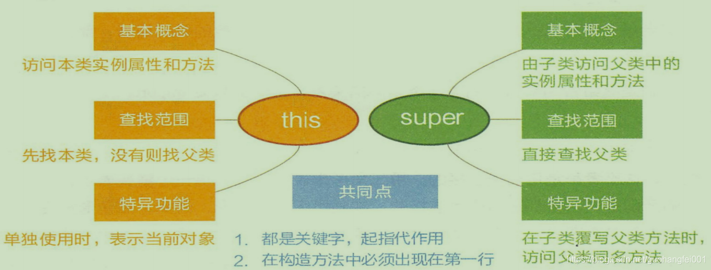
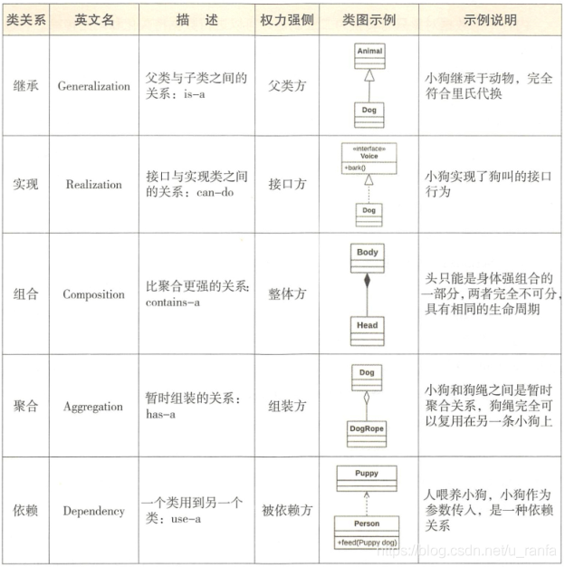
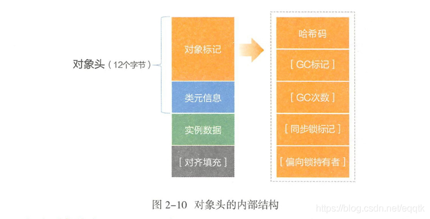

# 第 2 章 面向对象 

主流编程语言，主要分为两大阵营：面向对象编程和面向过程编程。

OOP 实践了软件工程的三个主要目标：可维护性，可重用性和可扩展性。

## 2.1 OOP 概念

传统意义上面向对象有三大特性：继承、封装、多态。笔者认为抽象也为面向对象特性之一。

Object 类中的方法：

（1）我是谁？`getClass()` 是用来说明本质上是谁，`toString()` 是当前名片；

（2）我从哪里来？ `Object()` 构造方法是生产对象的基本方式，`clone()`是繁殖对象的一种方式

（3）我到哪里去？`finalize()` 是再度向销毁时触发的方法；

`clone ()` 方法，分为浅拷贝、一般深拷贝和彻底深拷贝。对象默认的 clone 方法是浅拷贝。

（4）世界是否因你而不同？`hashCode` 和 `equals()` 是判断与其他元素是否相同的一组方法。

（5）与他人如何协调？`wait()` 和 `notify()` 是对象通信与协作的一组方法。

封装-迪米特法则：A 模块使用 B 模块的某个接口行为，对 B 模块中除此行为之外的其他信息知道得尽可能少。

继承-里氏代换原则（Liskov Substitution Principal，LSP）：任何父类能够出现的地方，子类都能够出现。

多态：使得模块在复用性的基础上更加具有扩展性，让运行期更具有想象空间。可以进行覆写`Override`和重载`Overload`就是很好地体现了多态的意义。

## 2.2 初识 Java

JDK5 新特性：foreach 循环，可变参数，枚举、自动装箱拆箱、泛型、注解、静态导入、格式化（System.out.println 支持%s %d等格式化输出）、线程框架/数据结构 JUC、Arrays工具类/StringBuilder/instrument。

JDK6 新特性：Desktop Deployment、Compiler API、Web Services、Scripting、Common Annotations 等。

JDK7 新特性：switch中添加对String类型的支持、数字字面量的改进 / 数值可加下划、异常处理（捕获多个异常） try-with-resources、增强泛型推断、NIO2.0（AIO）新IO的支持、InvokeDynamic 指令、Path接口、DirectoryStream、Files、WatchService、fork/join framework

JDK8 新特性：接口的默认方法与静态方法、Lambda表达式、函数式接口、方法引用（含构造方法引用）、Date/Time API 、流式处理等。

JDK9 新特性：平台级modularity（原名：Jigsaw） 模块化系统、简化内存 API、轻量级 JSON API、钱和货币的 API、进程改善和锁机制优化、代码分段缓存等。

JDK10 新特性：局部变量的类型推断 var 关键字、GC改进和内存管理，并行全垃圾回收器 G1、线程-局部变量管控、备用内存设备上的堆分配等。

JDK11 新特性：删除了 JavaEE 和 CORBA 模块，增加基于嵌套的访问控制，支持动态类型文件常量，改进 Aarch64 内联函数，提供 ZGC。

## 2.3 类

### 2.3.1 类的定义

类的定义由访问级别、类型、类名、是否抽象、是否静态、泛型标识、继承或实现关键字、父类或接口名称组成。

类的访问级别有 public 和无访问控制符。

类型为 class、interface、enum。

Java 类主要由两部分组成：成员和方法。

在定义 Java 类时，推荐首先定义变量，然后定义方法。先公有方法，然后保护方法，然后私有方法，最后是 getter/setter 方法。

### 2.3.2 接口与抽象类

接口与抽象类的语法区别：

| 语法维度               | 抽象类   | 接口                                     |
| :--------------------- | :------- | :--------------------------------------- |
| 定义关键字             | abstract | interface                                |
| 子类继承或实现的关键字 | extends  | extends                                  |
| 方法实现               | 可以有   | 不能有，JDK8 及以后，允许有 default 实现 |
| 方法访问控制符         | 无限制   | 有限制，默认是public abstract类型        |
| 属性访问控制符         | 无限制   | 有限制，默认是public abstract类型        |
| 静态方法               | 可以有   | 不能有                                   |
| static{静态代码块}     | 可以有   | 不能有                                   |
| 本类型之间扩展         | 单继承   | 多继承                                   |
| 本类型之间扩展的关键字 | extends  | extends                                  |

抽象类在被`继承`时体现的是`is-a`关系，而接口被实现时是`can-do`关系。

抽象类是模板式设计，类似一个模具，而接口是契约式设计，更像一个合同。

Java 语言中类的继承重用单继承形式。接口继承接口，允许多继承。

接口和抽象类中，优先推荐定义接口，遵循接口隔离原则，按某个维度划分成多个接口，然后用抽象类去 implements 某些接口，这样做可以方便后续扩展和重构。

### 3.3.3 内部类

在一个.java源文件中，只能定义一个类名与文件名完全一致的公开类，使用`public class`关键字来修饰，我们可以在这个类的内部和外部分别去定义另外的类，前者就叫内部类，后者叫外部类，内部类就成了这个类本身的一个属性，与其他属性的定义方式一致，可以使用`public`，`private`，`protected`访问权限关键字。可以定义成`static`静态内部类，当然类型也可以定义成`class`，`interface`和`enum`。

四种形式的内部类：

- 静态内部类
- 成员内部类
- 局部内部类
- 匿名内部类

无论是什么类型的内部类，都会编译成一个独立的 .class 文件，外部类和内部类之间使用 $ 符号来分隔，其中匿名内部类使用数字进行编号，而方法内部类，使用编号加方法名称来标识是哪个方法。

内部类的好处：

（1）作用域不会扩散到包外

（2）可以通过“外部类.内部类”的方法直接进行访问

（3）内部类可以访问外部类中的所有静态属性和方法

### 2.3.4 访问权控制

封装的实现需要使用关键字来限制类外部对类内属性和方法的随意访问，那么在Java中访问权限主要分为以下四个等级：

| 访问权限控制符 | 任何地方 | 包外子类 | 包内 | 类内 |
| :------------: | :------: | :------: | :--: | :--: |
|     public     |    OK    |    OK    |  OK  |  OK  |
|   protected    |    NO    |    OK    |  OK  |  OK  |
|       无       |    NO    |    NO    |  OK  |  OK  |
|    private     |    NO    |    NO    |  NO  |  OK  |

- **public**：可以修饰外部类、属性、方法。
- **protected**：只能修饰属性和方法，只能够被包内的类访问，当然还有一种情况就是只要是他的子类都可以访问。
- **无**： 并非是default，书中也明确说到定义外部类也极少用到无控制符的方式，一般要么定义public class，包外实例化；要么定义内部类，功能内聚。
- **private**：修饰属性、方法、内部类、被其修饰过的属性或方法只能在该类访问。

在定义类时，推荐访问控制级别从严处理：

1. 如果不允许通过外部通过 new 创建对象，构造方法必须是private。
2. 工具类不允许有 public 或者 default 构造方法。
3. 类非 static 成员变量并且与子类共享，必须是 protected。
4. 类非 static 成员变量并且仅在本类使用，必须是 private。
5. 类 static 成员变量如果仅在本类使用，必须是 private。
6. 类 static 成员变量，必须考虑是否为 final。
7. 类成员方法只供类内部调用，必须是 private。
8. 类成员方法只对继承类公开，那么限制为 protected。

### 2.3.5 this 与 super

`this`和`super`往往是默默无闻的，在很多情况不需要显式的调用，比如：

- 本类方法调用本类属性
- 本类方法调用另一个本类方法
- 子类构造器隐含调用`super()`

子类基层的父类，而父类坚持不提供默认的无参构造方法，必须在本类的无参构造方法中使用`super`方法调用父类的有参构造方法。

如果 this 和 super 代指构造方法，必须位于构造方法第一行，所以在一个构造方法中 this 和 super 只能出现其中的一个。

this 和 super 都是在实例化阶段调用，所以不能在静态方法和静态代码块中使用this和super关键字。

this 和 super 的异同点：



### 2.3.6 类的关系

类与类之间有关系的情况下，包括如下 6 种类型：

- **继承**：extends（is-a关系）
- **实现**：implements（can-do关系）
- **组合**：类是成员变量（contains-a关系）
- **聚合**：类似成员变量（has-a关系）
- **依赖**：import类（use-a关系）
- **关联**：是互相平等的关系(links-a)

类关系示例图：



### 2.3.7 序列化

内存中的数据对象只有转换为二进制流才可以进行数据持久化和网络传输。将数据对象转换为二进制流的过程称为对象的序列化（Serialization）。反之，将二进制流恢复为数据对象的过程称为反序列化（Deserialization）。

常见的三种序列化方式：

（1）Java原生序列化：Java类通过实现Serializable接口来实现该类对象的序列化，这个接口非常特殊，没有任何方法，只起标识作用。  

​		Java 序列化保留了对象类的元数据（如类、成员变量、继承类信息等），以及对象数据等，兼容性最好，但不支持跨语言，而且性能一般。

​		实现Serializable接口的类建议设置 serialVersionUID 字段值，如果不设置，那么每次运行时，编译器会根据类的内部实现，包括类名、接口名、方法和属性等来自动生成serialVersionUID。如果类的源代码有修改，那么重新编译后serialVersionUID 的取值可能会发生变化。因此实现Serializable接口的类一定要显式地定义 serialVersionUID属性值。修改类时需要根据兼容性决定是否修改serialVersionUID值：

- 如果是兼容升级，请不要修改serialVersionUID字段，避免反序列化失败。
- 如果是不兼容升级，需要修改serialVersionUID值，避免反序列化混乱。

使用Java原生序列化需注意，Java反序列化时不会调用类的无参构造方法，而是调用native方法将成员变量赋值为对应类型的初始值。基于性能及兼容性考虑，不推荐使用Java原生序列化。

（2）Hessian序列化。Hessian 序列化是一种支持动态类型、跨语言、基于对象传输的网络协议。Java 对象序列化的二进制流可以被其他语言（如C++、Python）反序列化。Hessian 协议具有如下特性:

- 自描述序列化类型。不依赖外部描述文件或接口定义，用一个字节表示常用基础类型，极大缩短二进制流。
- 语言无关，支持脚本语言。
- 协议简单，比Java 原生序列化高效。

Hessian 会把复杂对象所有属性存储在一个Map 申进行序列化。所以在父类、子类存在同名成员变量的情况下，Hessian 序列化时，先序列化子类，然后序列化父类，因此反序列化结果会导致子类同名成员变量被父类的值覆盖。

（3）JSON序列化。

JSON ( JavaScript Object Notation ）是一种轻量级的数据交换格式。JSON 序列化就是将数据对象转换为JSON 字符串。在序列化过程中抛弃了类型信息，所以反序列化时只有提供类型信息才能准确地反序列化。相比前两种方式，JSON 可读性比较好，方便调试。

通过加 transient 关键字，避免敏感信息被序列化。

## 2.4 方法

### 2.4.1 方法签名

方法签名包括方法名称和参数列表，是 JVM 标识方法的唯一索引，不包括返回值，更加不包括访问权限控制符、异常类型等。

### 2.4.2 参数

参数是方法签名的一部分，包括参数类型和参数个数。形参是在方法定义阶段，而实参是在方法调用阶段。

无论是对于基本数据类型，还是引用变量，Java 中的参数传递都是值复制传递过程。对于引用变量，复制指向对象的首地址，双方都可以通过自己的引用变量修改指向对象的相关属性。

可变参数列表，在使用时，尽量不要使用这种可变参数编程。如果要使用的话，则只有相同参数类型，相同业务含义的参数才可以，并且一个方法中只能有一个可变参数，且这个可变参数必须是该方法的最后一个参数。

方法的第一步骤并不是功能实现，而应该是参数进行预处理时。参数预处理主要包括以下两种：
 （1）入参保护。实质上是对服务提供方的保护（也就是接收参数，进行处理的一方）。常见于批量接口。虽然批量接口能处理一批数据，但其处理能力并不是无限的，因此需要对入参的数据量进行判断和控制，如果超出处理能力，可以直接返回错误给客户端。
 （2）参数校验：基于防御式编程理念，在方法内，无论是对方法调用方传入参数的理性不信任，还是对参数有效值的检测都是非常有必要的。但是，由于方法间交互是非常频繁的，如果所有方法都进行参数校验，就会导致重复代码及不必要的检查影响代码性能。综合两个方面考虑，汇总需要进行参数校验和无须处理的场景。
需要进行参数校验的场景：

- 调用频度低的方法。
- 执行时间开销很大的方法。此情形中，参数校验时间几乎可以忽略不计，但如果因为参数错误导致中间执行回退或者错误，则得不偿失。
- 需要极高稳定性和可用性的方法。
- 对外提供的开放接口。 ·
- 敏感权限入口。

不需要进行参数校验的场景：

- 极有可能被循环调用的方法。但在方法说明里必须注明外部参数检查。 ·
- 底层调用频度较高的方法。参数错误不太可能到底层才会暴露问题。
- 一般 DAO 层与 service 层都在同一个应用中，部署在同一台服务器中，所以可以省略DAO的参数校验。
- 声明成 private 只会被自己代码调用的方法。如果能够确定调用方法的代码传入参数已经做过检查或者肯定不会有问题，此时可以不校验参数。

### 2.4.3 构造方法

构造方法是特殊的方法，它有如下特征：

（1）构造方法名称必须与类名相同。

（2）构造方法没有返回类型，即使是 void 也不能有。

（3）不能被继承, 不能被覆写, 不能被直接调用。调用途径有三种： new，super，反射。

（4）类定义时提供默认的无参构造方法。如果显示定义有参构造后默认构造会被覆盖。

（5）构造方法可以私有。

接口中不能定义构造函数，抽象类可以。
静态代码块优先级最高, 在父子类之前执行, 并且只运行一次。

在创建类时，首先执行父类中的静态代码块，在执行子类中的静态代码块，再执行父类构造方法，子类构造方法。静态代码块只会执行一次。

### 2.4.4 类内方法

除构造方法外，类中还可以有三类方法：实例方法、静态方法、静态代码块。

1. 实例方法

   又称为非静态方法，依附于某个对象，可以通过引用变量调用其方法。类内部各个实例方法互相调用，但是不包含`this`。当 `.class` 字节码文件被加载后，实例方法并不会被分配方法入口地址，只有在对象被创建之后才会被分配。实例方法可以调用静态变量和静态方法，当从外部创建对象后，应该尽量使用「类名.静态方法」来调用，而不是对象名，依赖为编译器减负，二来提升代码可读性。

2. 静态方法

   又称类方法。当类被加载后，即分配了相应内存空间，由于生命周期的限制，使用静态方法需要注意两点：

   （1）静态方法中不能使用实例成员变量和实例方法。

   （2）静态方法不能使用 super 和 this 关键字，这两个关键字指代的都是需要被创建出来的对象。

3. 静态代码块

   非静态代码块又称局部代码块，又称局部代码块，是极不推荐的处理方式。

   静态代码块在类加载的时候被调用，并且只执行一次。静态代码块先于构造器执行，不能存在于任何方法体中，包括类的静态方法和属性变量。

### 2.4.5 getter 与 setter

这是一类比较特殊的方法，一般自身不包含任何业务逻辑，仅仅为了类成员属性提供读取和修改的方法，这样设计的好处就是：

- 满足面向对象语言封装的特性。将类成员属性设置成private，访问与修改统统交由getter与setter方法处理。
- 有利于统一控制。

出错的 getter 与 setter 方法定义方式：

（1）getter/setter 中添加业务逻辑。

（2）同时定义 `isXxx()` 和 `getXxx()`。 序列化场景中容易引起冲突。

（3）相同的属性名容易带来歧义。

### 2.4.6 同步与异步

同步调用是刚性调用，是阻塞式操作，必须等待调用方法体执行结束。而异步调用是柔性调用，是非阻塞式操作。

### 2.4.7 覆写

多态中的 override，即覆写。子类可以重新实现方法覆盖父类的实现，最终实现需要在运行期判断，这就是所谓的多态绑定。动态绑定时多态性得以实现的重要因素，元空间有一个方法表保存着每个可以实例化类的方法信息，JVM 可以通过方法表中的方法指向引用会指向子类的实现处。代码通常是使用这样的方式来调用子类方法，通常也被称为向上转型：

~~~java
Father father = new Son();
father.doSomething();
~~~

向上转型时，通过父类引用执行子类方法时需要注意以下两点：

（1）无法调用到子类存在而父类不存在的方法

（2）可以调用到子类中覆写了父类的方法，这是一种多态实现。

覆写父类方法的 4 个条件：

（1）访问权限不可小

（2）返回类型能够向上转型成父类返回类型。

（3）异常能向上转型成父类异常。

（4）方法名、参数类型及个数必需严格一致。

## 2.5 重载

同一个类中，如果多个方法有相同的方法名、不同的参数类型、参数个数、参数顺序，即称为重载。

在编译器眼里，方法名称 + 参数列表，组成一个唯一键，称为方法签名，JVM 通过这个唯一键决定调用哪种重载方法。注意，方法返回值并非是组合体中的一员。

JVM 重载方法中，选择目标方法的顺序如下：

（1）精确匹配

（2）如果是基本数据类型，自动转换成更大表示范围的基本类型。

（3）通过自动拆箱装箱。

（4）通过子类向上转型继承路线依次匹配。

（5）通过可变参数匹配。

父类的公有实例方法与子类的公有实例方法可以存在重载关系。重载又被称为静态绑定。

## 2.6 泛型

泛型的本质是类型参数化，解决不确定具体对象类型的问题。Java在引入泛型之前，表示可变类型往往存在类型安全的风险，泛型可以完美解决该问题。

泛型可以定义在类、接口、方法中，编译器通过识别尖括号和尖括号内的字母来解析泛型。现在一般约定俗成的符号包括：E：代表Element，用于集合中的元素。T：代表the type of object，表示某个类。K：代表Key。V：代表Value，K和V用于键值对元素。

下面这段代码可以很好地说明泛型定义的概念：

```java
public class EasyCoding<T> {

    static <String, T, Object> String get(String arg1, Object arg2) {
        System.out.println(arg1.getClass());
        System.out.println(arg2.getClass());
        return arg1;
    }

    public static void main(String[] args) {
        Integer arg1 = 996;
        Long arg2 = 965L;
        Integer result1 = get(arg1,arg2);

        byte[] b1 = new byte[666];
        byte[] b2 = new byte[666];
        byte[] result2 = get(b1,b2);
        
    }
}
```

首先这段代码是完全可以通过编译的，可能没用过泛型的小伙伴会疑问为什么`get()`方法可以传入`Integer`和`Long`甚至是`byte[]`类型？而且返回的结果不应该是`String`类型吗？其实关键就在于`<String, T, Object>`这个泛型标识，`String`是我们常见的所熟知的包装类了，`Object`是所有类的父类，但是在泛型标识里，它就不是`String`和`Object`了，而是可以成为任意类型，属于完全未知的类型，入参的第一个参数如果是`Integer`类型，那么在方法体内的所有`arg1`就不是我们认知里的`java.lang.String`了，这个`String`就是相当于之前说明的`T`，`Object`也是一种`T`，仅仅只是一个代号。当然我们平时编码不会也不要这样去定义泛型，确实会容易引发歧义和造成其他问题。所以我应该注意以下几点：

1. 尖括号里的每个元素都指代一种位置类型。`<String>`这里的`String`就不是我们认知上的`java.lang.String`了，仅仅只是个代号。包括类名后的`<T>`和get方法前的`<T>`是两个指代，互不影响。
2. 尖括号的位置非常讲究，必须在类名之后或方法返回值之前。
3. 泛型在定义处只具备执行Object方法的能力。所以`arg1`和`arg2`只能调用Object类中的方法，比如`toString()`。
4. 对于编码之后的字节码指令，其实没有这些花头花脑的方法签名，充分说明了泛型只是一种编码时的语法检查。

## 2.7 数据类型

### 2.7.1 基本数据类型

Java 有 9 种基本数据类型

| 类型名称 | 默认值   | 大小 | 最小值   | 最大值        | 包装类    | 缓存区域          |
| :------- | :------- | :--- | :------- | :------------ | :-------- | :---------------- |
| boolean  | false    | 1B   | 0(flase) | 1(true)       | Boolean   | 无                |
| byte     | (byte)0  | 1B   | -128     | 127           | Byte      | -128~127          |
| char     | ‘\u0000’ | 2B   | ‘\u0000’ | ‘\uFFFF’      | Character | (char)0~(char)127 |
| short    | (short)0 | 2B   | -2^15    | 2^15-1(32767) | Short     | -128~127          |
| int      | 0        | 4B   | -2^31    | 2^31-1        | Integer   | -128~127          |
| long     | 0L       | 8B   | -2^63    | 2^63-1        | Long      | -128~127          |
| float    | 0.0f     | 4B   | 1.4e-45  | 3.4e+38       | Float     | 无                |
| double   | 0.0d     | 8B   | 4.9e-324 | 1.798e+308    | Double    | 无                |

所有数值类型都是有符号的。

float 和 double 的最大值和最小值均指向正数区间，它们对应的包装类型没有缓存任何数值。

引用分为两种数据类型：引用变量本身和引用指向的对象。本书把引用变量 (Reference Variable) 称为 refvar，而把引用指向的实际对象 (Referred Object) 简称为 refobj。

refvar 是基本数据类型，它的默认值是 null，存储 refobj 的首地址，可以使用 == 进行等值判断。而平时使用的 `refvar.hashCode()` 返回的值，只是对象的某种哈希计算，可能与地址相关，与 refvar 本身存储的内存地址是两回事。refvar 占用 4B 空间。而无论 refobj 是多么小的对象，最小占用的存储空间是 12B（用于存储基本信息，称为对象头），由于存储空间分配必须是 8B 的整数倍，所以初始分配空间至少是 16B。

一个 refvar 至多存储一个 refobj 的首地址，一个 refobj 可以被多个 refvar 存储下它的首地址。

静态成员变量在类加载的时候就分配了内存，与实例对象容量无关。类中定义的方法代码不占用实例对象的任何空间。

对象分为三块存储区域：

 

（1）对象头（Object Header）

对象头占用 12 个字节，存储内容包括对象标记（markOop）和类元信息（klassOop）。对象标记存储对象本身运行时数据，如哈希码、GC 标记、锁信息、线程关联信息等，这部分数据在 64 位 JVM 上占用 8 个字节，称为”Mark Word“。对象标记存储格式非固定（具体与 JVM 实现有关）。类元信息存储的是对象指向它的类元数据（即 Klass）的首地址，占用 4 个字节。

（2）实例数据

存储本类对象的实例成员变量和所有可见的父类成员变量。

（3）对齐填充

对象的存储空间分配单位是8 个字节，如果一个占用大小为16 个字节的对象，增加一个成员变量byte 类型，此时需要占用17 个字节，但是也会分配24 个字节进行对齐填充操作。

### 2.7.2 包装类型

前 8 种基本数据类型都有对应的包装类型。

解决了基本数据类型无法做到的事：泛型类型参数、序列化、类型转换、高频区间数据缓存。

除了 Float 和 Double 外，其他包装类型数据都会缓存，6 个包装类型直接赋值时，就是调用的对应包装类的静态工厂方法 `valueOf()`，以 Integer 为例，源码如下：

```java
public static Integer valueOf(int i) {
    if (i >= IntegerCache.low && i <= IntegerCache.high)
        return IntegerCache.cache[i + (-IntegerCache.low)];
    return new Integer(i);
}
```

JDK9 直接把 new 的构造方法过时，推荐使用 `valueOf()`，合理使用缓存，提高性能。各个包装类的缓存区间：

- Boolean：使用静态final变量定义，`valueOf()`就是返回这两个静态值。
- Byte：表示范围是 -128~127，全部缓存。
- Short：表示范围是 -32768~32767，缓存范围是-128127。
- Character：表示范围是 0~65535，缓存范围是0127。
- Long：表示范围是[(-2^63),(2^63)-1]，缓存范围是-128~127。
- Integer：表示范围[-2^31,(2^31)-1]。

在选择使用包装类和基本类型的时候，也不能完全按照心情，我们可以从以下几点来看：

1. 所有的POJO类属性必须使用包装数据类型。
2. RPC方法的返回值和参数必须使用包装数据类型。
3. 所有的局部变量推荐使用基本数据类型。

### 2.7.3 字符串

字符串是从堆上分配而来。相关类型主要是三种：String、StringBuilder、StringBuffer。

String是只读字符串，典型的 immutable 对象，对它的任何改动，其实都是创建一个新对象，再把引用指向该对象。String 对象赋值操作后，会在常量池中进行缓存，下次申请创建对象时，如缓存中已经存在，则直接返回相应引用给调用者。而 StringBuffer 可以在原对象上进行修改，是线程安全的。StringBuilder是非线程安全的，把多线程的锁的处理交给工程师来处理，所以操作效率比 StringBuffer 高。线程安全的对象的产生一般是因为计算机的发展总是从单线程到多线程，从单机到分布式。

字符串的连接方式在循环体内非常不推荐使用String类型相加，而是应该使用StringBuilder的append方法。如下代码是不推荐的：

~~~java
String str = "start";
for(int i=0;i<100:i++){
    str = str + "hello";
}
~~~

此段代码的内部实现逻辑是每次循环都会 new 一个 StringBuilder 对象，然后进行 append 操作，最后通过 toString() 方法返回 String 对象，浪费内存资源，性能差。

