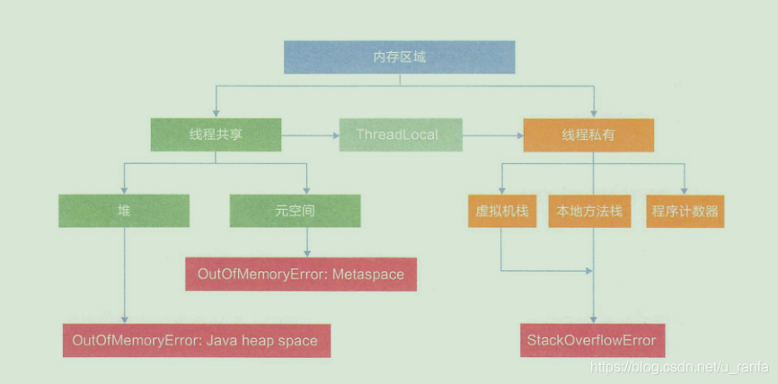

# 第 4 章 走进 JVM

## 4.1 字节码

Java 所有的指令有 200 个左右，一个字节（8 位）可以存储 256 种不同的指令信息，一个这样的字节码称为字节码（Bytecode）。

JVM 将字节码编译执行，如果是热点代码，会通过 JIT 动态地编译成机器码，提高执行效率。

字节码主要指令如下：

1. 加载或存储指令

   （1）将局部变量加载到操作栈中。ILOAD 和 ALOAD 等。

   （2）从操作栈顶存储到局部变量表。如 ISTORE、ASTORE 等。

   （3）将常量加载到操作栈顶，这是极为高频使用的指令。如 ICONST、BIPUSH、SIPUSH、LDC 等。

2. 运算指令

   对两个操作栈帧上的值进行运算，并把结果写入操作栈顶，如 IADD、IMUL 等。

3. 类型转换指令

   显示转换两种不同的数值类型。如 I2L、D2F 等。

4. 对象创建与访问指令

   根据类进行对象的创建、初始化、方法调用相关指令，常见指令如下：

   （1）创建对象指令。如 NEW、NEWARRAY 等。

   （2）访问属性指令。如 GETFIELD、PUTFIELD、GETSTATIC 等。

   （3）检查实例类型指令。如 INSTANCEOF、CHECKCAST 等。

5. 操作栈管理指令

   （1）出栈操作。POP，POP2。

   （2）复制栈顶元素并压入栈。如 DUP。

6. 方法调用与返回指令

   （1）INVOKEVIRTUAL 指令：调用对象的实例方法。
   
   （2）INVOKESPECIAL 指令：调用实例初始化方法、私有方法、父类方法。
   
   （3）INVOKESTATIC 指令：调用类静态方法。
   
   （4）RETURN 指令：返回 VOID 类型。
   
7. 同步指令

   在 JVM 中通过使用 ACC_SYNCHRONIZED 标志同步方法。指令集中有 montiorenter 和 monitorexit 支持synchronized语义。

字节码必须通过类加载过程加载到JVM环境后，才可以执行。执行有三种模式：

第一，解释执行；第二，JIT 编译执行；第三，JIT 编译与解释混合执行（主流JVM默认执行模式）。

混合执行模式的优势在于解释器在启动时先解释执行，省去编译时间。随着时间推进，JVM通过热点代码统计分析，识别高频的方法调用、循环体、公共模块等，基于强大的JIT动态编译技术，将热点代码转换成机器码，直接交给CPU 执行。JIT的作用是将Java字节码动态地编译成可以直接发送给处理器指令执行的机器码。

 机器在热机状态可以承受的负载要高于冷机状态（刚启动时），如果以热机状态时的流量进行切流，可能使冷机状态的服务器因无法承载流量而死。在产生环境中应该以分批的方式进行发布，建议每个批次至多占整个集群的 1/8。

## 4.2 类的加载过程

在加载时，使用的是 Parents Delegation Model，即双亲委派模型。

Java 的类加载器主要是在启动阶段进行类的 Load、Link 和 Init，即加载、链接、初始化。

第一步，Load 阶段读取类文件产生的二进制流，并转化为特定的数据结构，初步校验 cafe babe 魔法数、常量池、文件长度、是否有父类等，然后创建对应类的 java.lang.Class 实例。

第二步，Link 阶段包括验证、准备、解析三个步骤。验证是更详细的校验，比如 final 是否合规、类型是否正确、静态变量是否合理等；准备阶段是为静态变量分配内存，并设定默认值，解析类和方法确保类之间的相互引用正确性，完成内存布局。

第三步，Init 阶段执行类的构造器\<clinit\> 方法，如果运算是通过其他类的静态方法完成的，那么马上解析另外一个类，在虚拟机栈中执行完毕后通过返回值进行赋值。

- Class 类下的 newInstance() 在 JDK9 中已经置为过时，使用 getDeclaredConstructor().newInstance() 的方式。new 与 newInstance() 的区别。new 是强类型校验，可以调用任何方法，在使用 new 操作的时候，这个类可以是可以没被加载过。而 Class 类下的 newInstance() 是弱类型，只能调用无参数构造方法，如果没有默认构造方法，就抛出 InstantiationException 异常；如果此构造方法没有权限访问，则抛出 IllegalAccessException 异常。Java 通过类加载器把类的实现与类的定义进行解耦，所以是实现面向接口编程、依赖倒置的必然选择。
- 可以使用一组类似的方法获取声明，如构造方法、注解、方法等。
- 通过 setAccessible(true) 操作，即可使用大写 Class 类的 set 方法修改 private 成员的值。否则抛出异常。

自定义类加载器的场景：

（1）隔离加载类。

（2）修改加载方式。

（3）扩展加载源。

（4）防止源码泄漏。

实现自定义类加载器的步骤：继承 ClassLoader，重写 findClass() 方法，调用 defineClass() 方法。

## 4.3 内存布局

JVM 内存布局规定了 Java 在运行时过程中内存申请、分配、管理的策略，保证了 JVM 的高效稳定运行。

1. Heap (堆区)

   它存储着几乎所有的示例对象，由垃圾收集器自动回收，堆由各子线程共享使用。通过如下参数设定初始值和最大初始值，如 -Xms256M -Xmx1024M，其中 -X 表示它是 JVM 运行参数， ms 是 memory start 的简称，mx 是 memory max 的简称，分别代表最小堆和最大堆容量。   

   堆分成两大块：新生代和老年代。对象产生之初在新生代，步入暮年时进入老年代，但是老年代也接纳在新生代无法容纳的超大对象。新生代 = 1 个 Eden 区 + 2 个 survivor 区。绝大部分对象在 Eden 区生成，但 Eden 区装填满的时候，会触发 Young Garbage Collection，即 YGC。垃圾回收的时候，在 Eden 区实现清除策略，没有被引用的对象直接被回收。依然存活的对象会被复制到 Survivor区，这个区分为 S0 和 S1 两块内存空间，每次 YGC 的时候，它们将存活的对象复制到未使用的那块空间，然后将当前正在使用的空间完全清除，交换两块空间的状态。如果 YGC 要移送的对象大于 Survivor 区容量的上限，则会直接移交给老年代。每个对象有个计数器，每次 YGC 都会增加 1. -XX:MaxTenuringThreshold 参数能配置计数器的值达到某个阈值的时候，对象从新生代晋升到老年代。默认值为 15，可以在 Survivor 区交换 14 次后，晋升至老年代。

   

   Survivor 区无法放下，或者超大对象的阈值超过上限，则尝试在老年代分配；如果老年代也无法放下，则会触发 Full Garbage Collection，即 FGC。如果依然无法放下，则抛出 OOM。JVM 通过设置参数：-XX:+HeapDumpOnOutOfMemoryError，让 JVM 遇到 OOM 异常时输出堆内存信息。

2.  Metaspace（元空间）

    JDK8 将 Perm 区中的所有内容中的字符串常量移至堆内存，其他内容包括类元信息，字段，静态属性，方法，常量等都移动至元空间内。

3. JVM Stack（虚拟机栈）

   JVM 是基于栈结构的运行环境。JVM 中的虚拟机栈是描述 Java 方法执行的内存区域，它是线程私有的。栈中的元素用于支持虚拟机进行方法调用，每个方法从开始调用到执行完成的过程，就是栈帧从入栈到出栈的过程。在活动线程中，只有位于栈顶的帧才是有效的，称为当前栈帧。正在执行的方法称为当前方法，栈帧是方法运行的基本结构。

   

   正常结束的方法，肯定会跳转到另一个栈帧上。在执行过程中，如果出现异常，会进行异常回溯，返回地址通过异常处理表确定。

   栈帧包括局部变量表、操作栈、动态链接、返回返回地址等。

   （1）局部变量表

   ​	局部变量表是存放方法参数和局部变量的区域。局部变量表没有准备阶段，必须显示初始化。如果是非静态方法，则在 index[0] 位置上存储的是方法所属对象实例引用，随后存储的是参数和局部变量。字节码指令中的 STORE 指令是将操作栈中计算完成的局部变量写回局部变量表的存储空间内。

    （2）操作栈

   ​	操作栈是一个初始状态为空的桶式结构栈。会有各种指令往栈中写入和提取信息。JVM 的执行引擎是基于栈的的执行引擎，其中的栈指的就是操作栈。字节码指令集的定义都是基于栈类型的，栈的深度在方法元信息的 stack 属性中，下面的示例代码简单说明了操作栈与局部变量表的交互:
   
   ~~~java
   public int simpleMethod(){
       int x = 13;
       int y = 14;
       int z = x +y;
       return z;
   }
   ~~~
   
   详细的字节码操作顺序如下：
   
   ~~~java
   public simpleMethod();
   flags: ACC_PUBLIC
   Code:
     stack=2, locals=4, args_Size=1 // 最大栈深度为 2，局部变量个数为 4
     	BIPUSH 13 // 常量 13 压入操作栈
   	ISTORE_1 // 并保存到局部变量表的 slot_1 中
       
       BIPUSH 14 // 常量 14 压入操作栈，注意是 BIPUSH
   	ISTORE_2 // 并保存到局部变量表的 slot_2 中
       
       ILOAD_1 // 把局部变量表的 slot_1 元素 (int x) 压入操作栈
       ILOAD_2 // 把局部变量表的 slot_2 元素 (int y) 压入操作栈
       
       IADD // 把上方的两个数都取出来，在 CPU 里加一下，并压回操作栈
       ISTORE_3 // 把栈顶结构存储到局部变量表的 slot_3 中
       ILOAD_3 
       IRETURN // 返回栈顶元素
   ~~~
   
   ​		任何时候只能对栈顶数据进行存取。某些指令可以直接在局部变量表中进行操作，如 iinc 指令，直接对局部变量表中的数值进行 +1 操作。
   
    （3）动态链接

   ​		每个栈帧中包含一个在常量池中对当前方法的引用，目的是支持方法调用过程中的动态链接。
    （4） 方法返回地址
   
   ​		方法执行时有两种退出情况：第一，正常退出，即正常执行到任何方法的返回字节码指令；第二，异常退出。无论何种退出情况，就将返回至当前方法被调用的位置。方法退出的过程相当于弹出当前栈帧，退出可能有三种方式：
   
   - 返回值压入上层调用栈。
   - 异常信息抛给能处理的栈帧。
   - PC 计数器指向方法调用后的下一条指令。
   
4. Native Method Stacks （本地方法栈）

   本地方法栈内存溢出会抛出 native heap OutOfMemory。

5. Program Counter Register （程序计数寄存器）

   寄存器存储指令相关的现场信息， 由于CPU时间片轮限制，众多线程在并发执行过程中，任何一个确定的时刻，一个处理器或者多核处理器中的一个内核，只会执行某个线程中的一条指令。 这样必然导致经常中断或恢复，如何保证分毫无差呢？每个线程在创建后，都会产生自己的程序计数器和栈帧，程序计数器用来存放执行指令的偏移量和行号指示器等，线程执行或恢复都要依赖程序计数器。 程序计数器在各个线程之间互不影响，此区域也不会发生内存溢出异常。

   

## 4.4 对象实例化

Java 实例化对象过程：

1. 简单的 Object ref = new Object()；

   ~~~java
   stack=2,locals=1,args_size=0
     new java/lang/Object
     dup
     invokespecial java/lang/Object.<init> ()V
     astore_1
     LocalVaiableTable:
   	Start  Length  Slot  Name  Signature
         8		   1    0     ref   Ljava/lang/Object;
   ~~~

   - New：如果找不到 Class 对象，则进行类加载。加载成功后，则在堆中分配内存，从 Object 开始到本类上路径上的所有属性值都要分配内存。分配完毕过后，进行零值初始化。在分配过程中，注意引用时占据存储空间的，它是一个变量，占用 4 个字节。这个指令完毕后，将指向实例对象的引用压入虚拟机栈顶。
   - DUP：在栈顶复制该引用变量，这时的栈顶有两个指向堆内实例对象的引用变量。如果 \<init\>  方法有参数，还需要把参数压入操作栈中。两个引用变量的目的不同，其中压至底下的引用用于赋值，或者保存到局部变量表，另外一个栈顶引用变量作为句柄调用相关方法。
   - invokespecial：调用对象实例方法，通过栈顶的引用变量调用 \<init\> 方法。 \<cinit\>  是类初始化时执行的方法，而 \<init\> 是对象初始化时执行的方法。

2. 前面是从字节码角度说明对象创建过程，现在从执行步骤的角度进行分析：

   - 确认类元信息是否存在。当 JVM 接收到 new 指令时，首先在 metaspace 内检查需要创建的类元信息是否存在。若不存在，那么在双亲委派模式下，使用当前类加载器以 ClassLoader + 包名 + 类名为 Key 进行查找对应的 .class 文件。如果没有找到文件，则抛出 ClassNotFoundException 异常；如果找到，则进行类加载，并生成对应的 Class 类对象。
   - 对象分配内存。首先计算对象占用空间大小，如果实例成员变量时引用变量，仅需分配引用变量空间即可，即 4 字节大小，接着在堆中划分一块内存给新对象。在分配内存空间时，需要进行同步操作，比如采用 CAS失败重试、区域加锁等方式保证分配操作的原子性。
   - 设定默认值。成员变量值都需要设定默认值，即不同形式的零值。
   - 设置对象头。设置新对象的哈希码、GC 信息、锁信息、对象所属的类元信息等。这个过程基于 JVM实现。
   - 执行 init 方法。初始化成员变量，执行实例化代码块，调用类的构造方法，并把堆内对象的首地址赋值给引用变量。

   ## 4.5 垃圾回收

   垃圾回收的主要目的时清除不再使用的对象，自动释放内存。

   JVM 引入 GC Roots，来判断对象是否可以被回收。如果一个对象与 GC Roots 之间没有直接或间接引用关系，则是可以被回收的。什么对象可以作为 GC Roots呢？比如：静态属性中引用的对象、常量引用的对象、虚拟机栈中引用的对象、本地方法栈中引用的对象等。

   “标记-清除算法”，该算法会从每个 GC Roots 出发，依次标记有引用关系的对象，最后将没有被标记的对象清除。

   “标记-整理算法”，首先会从 GC Roots 出发标记存活对象，然后将存活对象进行整理到内存空间的一端，形成连续的已使用空间，最后把已使用空间之外的部分全部清理掉。

   “Mark-Copy 算法”，为了能够并行地标记和整理将空间分成两块，每次只激活其中地一块，垃圾回收时只需要把存活对象复制到另外一块未激活地空间上，将未激活地空间标记为已激活，将已激活空间标记为未激活，然后清除原空间中地原对象。堆内存空间被分为较大的 Eden 和两块较小的 Survivor，每次只使用 Eden 和 Survivor 区中的一块。该算法是主流的 YGC 算法进行新生代的垃圾回收。

   Serial 回收器是一个主要应用于 YGC (Mark-Copy)的垃圾回收器，采用串行单线程的方式完成 GC 任务。

   
   
   CMS 回收器 (Concurrent Mark Sweep Collector)，它通过初始标记 (Initial Mark)、并发标记(Concurrent Mark)、重新标记 (Remark) 、并发清除（Concurrent Sweep）四个步骤完成垃圾回收工作。第 1、3 步的初始标记和重新标记阶段 依然会引发 STW，而第 2、4 步的并发标记和并发清除阶段可以和程序并发执行。CMS 采用的是 “标记-清除算法”。
   
   G1（Garbage-First Garbage Collector）垃圾回收器，通过 -XX:+UseG1GC 参数启用。G1 将 Java 堆空间分割成若干大小相同的区域，即 region，包括 Eden、Survivor、Old、Humongous 四种类型。其中，Humongous 是特殊的 Old 类型，专门放置大对象。这样的划分方式意味着不需要一个连续的内存空间管理对象。G1 将空间分为多个区域，优先回收垃圾最多的区域。G1 采用的是 “Mark-Copy”。G1 可预测停顿时间，能够在尽可能快地在指定时间内完成垃圾回收任务。
   
   S0/S1 的功能由 G1 中的 Survivor region 来承担。
   
   G1 中的四种 region，都处于 Heap 中。G1 执行时使用 4 个 worker 并发执行，在初始标记时还是会触发 STW。G1 的 Concurrent Marking 分为五个主要步骤：
   
   第一步，Initial Mark，其实就是 Young GC。该阶段会引起STW， 它会标记 GC Roots 直接可达的存活对象。
   
   第二步，Root Region Scan，即根区域扫描。该阶段不会引起STW， 它会并发地从上一阶段标记的存活区域中扫描被引用的老年代对象。
   
   第三步，Concurrent Mark， 即并发标记。该阶段从堆中标记存活的对象， 与 CMS类似。
   
   第四步，Remark， 即重新标记。该阶段会引起 STW， 与 CMS 类似。它会完成最终的标记处理。
   
   第五步，Cleanup，主要为接下来的 Mixed GC做准备。该阶段会统计所有堆区域中的存活对象，并将待回收区域按回收价值排序，优先回收垃圾最多的域。
   
   在JDK 11版本中，引入试验性质的新 GC 算法 ZGC，它是一个可伸缩的低延垃圾收集器。ZGC 会因为 GC Root 增大而增加暂停时间，比如很多Thread。Thread的堆栈很深，但是与堆大小以及 Live Data Size无关。与 G1 一样在 ZGC 中将堆内存分成大量的内存区域，即 ZPage， 区别是ZGC中的区域大小是不相同的， 有小型、中型和大型之分。在小型 page 中分配小对象， 最大为256KB， 在中型 page 中分配中等大小的对象，最大为4MB；在大型 page 中分配大于4MB的对象。ZGC 包括十个阶段， 最主要的两个阶段是 mark 和 relocate，GC 不断从标记阶段开始循环，递归所有可达对象， 标记结束时可以知道哪些对象可以被回收。ZGC将标记结果存储在每个page 的 live bitmap 中。在标记过程中，应用线程中的 load barrier 将暂时未标记的引用对象压入缓冲区。一旦缓冲区满，GC 线程会递归遍历此缓冲区中所有可达对象。标记结束后， ZGC需要迁移 relocate 集合中所有的对象。relocate 集合是一组 page 集合，根据某些标准， 系统决定是否需要迁移它们。ZGC 为每个 relocate 集合的页面分配了 forwarding table。它是一个哈希映射（如果对象已经被迁移），它存储一个对象被移动后的新地址。为了实现 ZGC 的目标， 增加了两种方式：着色指针和读屏障。前者使用简洁的多重映射技巧可以处理更多的内存。所谓试验性质是指该策略在 JDK11中只会支持 Linux 系统，其他平台暂不支持，并且在生产环境中还需要考虑如下问题：第一， 如何支持 class unloading，这是一个功能性缺失； 第二，compressed ref 和 ZGC 是冲突的，开ZGC，一定不能有 compressed ref；第三， 解决 single generation问题， 因为应用的分配速率过高的话，GC有可能跟不上，这可能是潜在问题。
