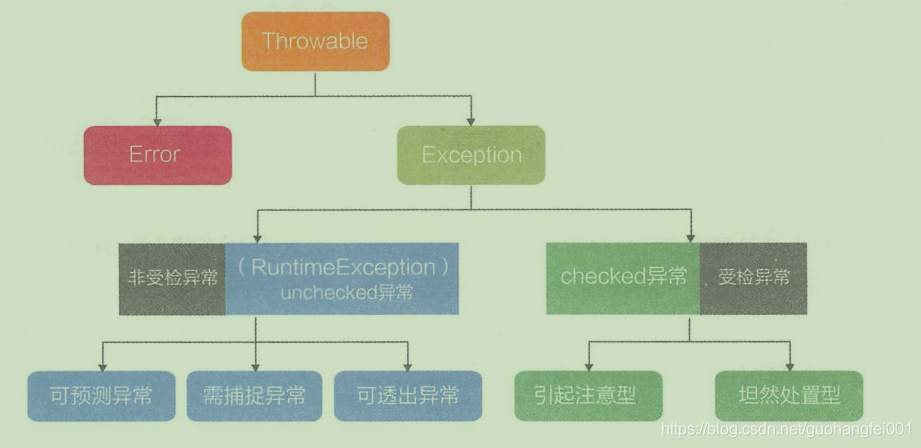
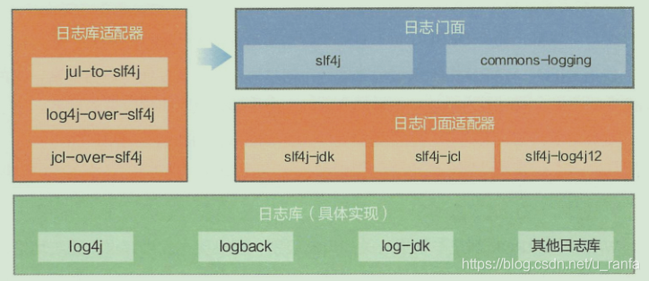

# 第 5 章 异常与日志

处理程序异常，需要解决以下 3 个问题：

（1）哪里发生异常。

（2）谁来处理异常。

（3）如何处理异常。

首先，需要明确在哪里发生异常。捕获异常时需要分清稳定代码和非稳定代码，稳定代码指的是无论如何都不会出错的代码。异常捕获是针对非稳定代码的，捕获时要区分异常类型并做相应的处理。

其次，判断谁来处理异常，如果异常在当前方法的处理能力之内且没必要对外透出，那么直接捕获异常并做相应处理；否则向上抛出，由上层方法或框架处理。

最后，无论采用哪种方式处理异常，都严禁捕获异常后什么都不做或打印一行日志了事。

## 5.1 异常分类

JDK 中定义了套完整的异常机制，所有异常都是 Throwable 的子类，分为Error（致命异常）和Exception （非致命异常）。Error 是一种非常特殊的异常类型，它的出现标识着系统发生了不可控的错误，例如 StackOverflowError 、OutOfMemoryError 。针对此类错误，程序无法处理，只能人工介入。Exception 又分为 checked 异常（受检异常）和 unchecked 异常（非受检异常）。

## 5.2 try 代码块

当存在 try 时，可以只有 catch 代码块，也可以只有 finally 代码块，不能只有 try 代码块。

（1）try 代码块：监视代码块执行过程，一旦发现异常则直接跳至 catch，如果没有 catch 则直接调至 finally。

（2）catch 代码块：可选执行的代码块，如果没有如何异常发生则不会执行；如果发现异常则进行处理或向上抛出。

（3）finally 代码块：必选执行代码块，不管是否产生异常。如果 finally 代码块没有执行，那么有三种可能：

- 没有进入 try 代码块。
- 进入 try 代码块，但是代码块中出现了死循环或者死锁状态。
- 进入 try 代码块，但是执行了 System.exit() 操作。

注意，finally 是在 return 表达式执行后执行的，此时将要 return 的结果已经被暂存起来，待 finally 代码块执行结束后再将之前暂存的结果返回。

lock 返回可能会抛出 uncheck 异常，一般在 try 代码块之前调用 lock() 方法，避免由于加锁失败导致 finally 调用 unlock() 抛出异常。

## 5.3 异常的抛与接

异常的抛与接，需要严格的对等传递异常信息机制。我们要使捕获的异常与被抛出的异常是完全匹配的，或者捕获的异常是被抛出异常的父类。

推荐对外提供的开放接口使用错误码；公司内部跨应用远程服务调用优先考虑使用 Result 对象来封装错误码、错误描述信息；而应用内部则推荐直接抛出异常对象。

断网的情况下，连空集合都无法返回，会抛出 NPE。所以推荐方法的返回值可以为 null，不强制返回空集合或空对象，当是必须添加注释说明什么时候会返回 null。防止 NPE 一定是调用方的责任，需要在调用方进行事先判断。

## 5.4 日志

记录日志的三个原因：记录操作轨迹、监控系统运行情况、回溯系统故障。

### 5.4.1 日志规范

应用中的扩展日志命名方式应该统一约定，通过命名能直接表明当前日志文件是什么功能，如监控、访问日志等。推荐的命名方式为： appName_logType_logName.log。其中 logType 为日志类型，推荐分类有 stats/monitor/visit 等；logName 为日志描述。这种命名的好处是通过文件名就可知道日志文件属于什么应用，什么类型，什么目的，也有利于归类查找。

日志文件推荐至少保存15天，因为有些异常具备以“周”为频次发生的特点。

五种日志级别：

- DEBUG级别日志：记录对调试程序有帮助的信息。
- INFO级别日志：用来记录程序运行现场，虽然此处并未发生错误，但是对排查其他错误具有指导意义。
- WARN级别日志：也可以用来记录程序运行现场，但是更偏向于表明此处有出现潜在错误的可能。
- ERROR级别日志：表明当前程序运行发生了错误，需要被关注。但是当前发生的错误，没有影响系统的继续运行。
- FATAL级别日志：表明当前程序运行出现了严重的错误事件，并且将会导致应用程序中断。

在打印日志时，针对不同日志级别的处理方式：

1. 预先判断日志级别。对DEBUG、INFO级别的日志，必须使用条件输出或者使用占位符的方式打印。该约定综合考虑了程序的运行效率和日志打印需求。例如，在某个配置了打印日志级别为 WARN 的应用中，如果针对DEBUG级别的日志，仅仅在程序中写出logger.debug("Processing trade with id:"+ id + " and symbol:"+ symbol)，日志不会被打印，但是会执行字符串拼接操作；如果 symbol 是对象，还会执行 toString() 方法，白白浪费系统资源。如下实例代码为正确的打印日志方式：

   ~~~java
   // 使用条件判断形式
   if(logger.isDebugEnable()){
      logger.debug("Processing trade with id:"+ id + " and symbol:"+ symbol);
   }
   // 使用占位符形式
      logger.debug("Processing trade with id: {} and symbol:{}",id,symbol);
   ~~~

2. 避免无效曰志打印：

   生产环境禁止输出DEBUG日志，且有选择的输出INFO日志。在输出DEBUG和INFO级别的日志时，一定要注意磁盘的日志输出量。同时要为日志文件设置合理的生命周期，及时清理过期日志。避免重复打印，务必在日志配置文件中设置 additivity=false。

3. 区别对待错误日志

   WARN、ERROR都是与错误有关的日志级别，但不要一发生错误就笼统地输出 ERROR级别日志。ERROR级别只记录系统逻辑错误、异常或者违反重要的业务规则，其他错误都可以归为WARN 级别。

4. 保证记录内容完整

   （1）记录异常时一定要输出异常堆栈，例如 logger.error(“xxx”+e.getMessage(), e)

   （2）日志中如果输出对象实例，要确保实例类重写了 toString 方法，否则只会输出对象的 hashCode 值，没有实际意义。

### 5.4.2 日志框架

日志框架分为三大部分：日志门面，日志适配器，日志库。

1. 日志门面

   日志框架采用门面设计模式，类似于JDBC设计理念。它只提供一套接口规范，自身不负责日志功能的实现。目的是让使用者不需要关注底层是哪个日志库来负责日志打印及具体的使用细节等。目前主要试用的日志门面有两种：commons-logging，slf4j。

2. 日志库

   它具体实现了日志的相关功能， 目前主流的日志库有三个，分别是 log4j (log4j2)、log-jdk、logback。log4j为最早诞生的日志库。logback 实现了slf4j的接口。

3. 日志适配器

   日志适配器分两种场景:

   （1）日志门面适配器，因为 slf4j 的规范是后来提出的，在此之前的日志库是没有实现 slf4j 的接口的，例如 log4j；所以，在工程里要想使用 slf4j+log4j 的模式，就额外需要一个适配器（sif4j-log4j12）来解决接口不兼容的问题。
   （2）日志库适配器，在一些老的工程里，一开始为了开发简单而直接使用了日志库 API 来完成日志打印，后来想修改为标准的门面模式，但老工程代码里打印日志太多，难以改动，所以需要一个适配器来完成从旧日志库的API到 slf4j 的路由，这样在不改动原有代码的情况下也能使用 slf4j 来统一管理日志，而且后续对日志库自由替换也不成问题。

如果是新工程推荐使用 slf4j + logback 模式。

slf4j + 日志库模式时，要防止日志库冲突，一旦发生可能出现日志打印功能失效的问题。

